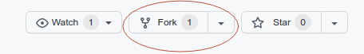
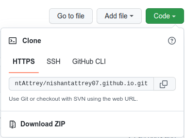
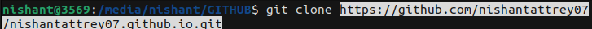

# nishantattrey07.github.io
Hey everyone, this repo is beginner friendly made for the developer who has started in Front-End Development and also wants to start with Open Source. In this project, you can learn about HTML and also modify the website according to you or add something you have learned.
Happy Contributing.
 
<h2>How to Start?</h2>
<ul>
<li>First, go through the website and try to understand what is this website about</li>
<li>
If your interests align with the aim of the project (to learn and share your learning and help others to learn ) <b>Fork the repository and then clone it</b></li>
 

Now you will say "dude we are beginners, how we are going to fork and clone it?" 
 Don't worry  I am here to guide you through the step-wise process of making your first ever Open-Source contribution if you have not already

<h3>Fork and Clone<h3>
<ol>
<li><b>Forking the Repository</b>
 Go to the repository and At the top mid right of the repository their is an option of fork, click it and fork the repository
<figure>
 
</figure>
</li>
 
<li>
<b>Cloning the repository</b>
<ol>
<li>
 Now go to your accounts forked repository, you will find green colour code button on right side of your screen
<figure>
 
</figure>
</li>
<li>
 Now copy the link of forked repository from your account
<figure>
 
</figure>
</li>
<li>
 After copying link, open terminal in your preferred drive to copy the project to your system by typing <b> <code>git clone &lt;link you copied&gt;</code></b>
<figure>
 
</figure>
</li>

</ol>

</ul>
